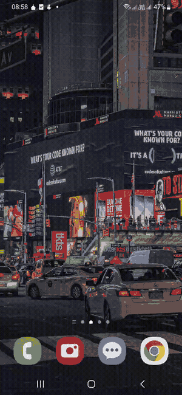

<p align="center">
  
</p>

<h1 align="center">Ghossh</h1>

<p align="center">
 A Modern, Native Android SSH client powered by libghostty
</p>

<p align="center">
  <a href="https://github.com/ljsydpwym/ghossh/releases/latest">Download Latest</a> ·
  <a href="https://github.com/ljsydpwym/ghossh/releases/">ChangeLog</a> ·
</p>

---

<table align="center" cellpadding="10">
  <tr>
    <td></td>
    <td></td>
    <td></td>
    <td></td>
</table>

Ghossh is a native Android SSH client powered by libghostty, with a terminal-first Compose UI and support for both standard SSH and Tailscale SSH workflows.

This project is based on [Chuchu](https://github.com/jossephus/chuchu) by [jossephus](https://github.com/jossephus) — the original native Android SSH client. Ghossh continues the development with its own direction, improvements, and features.

### Features
- tailscale, ssh password + key authentication
- image display using libghostty's kitty image protocol support
- more than 400 themes from the official ghostty repository
- configurable accessory keys
- beautiful and working terminal renderer with fully working resize, scrollback, focus, modifier keys, mouse actions
- clickable links in terminal output

## Status

Ghossh is in active development. I am daily driving it and improving any issues I find along the way. Join the journey and report any bugs you find. Contributions are welcome!

### Getting Started

Checkout our releases and download the APK from there. The latest release will have the latest changes.

I don't have a personal Play Store account right now (and I can't open one because of the payment limitation in my country, feel free to contact me if you want to publish it.)


## Stack

- Kotlin + Jetpack Compose for the Android app
- Zig for native build orchestration and JNI/native bridge code
- Ghostty VT for terminal emulation
- `libssh2` + `openssl` for the current native SSH path
- Room for local data storage


### Development - Prerequisites

If you have nix installed, the following three steps will get you started:

1. `nix develop` — sets you up with everything you need
2. `make build` — builds the native code
3. `make app` — builds the APK and installs it on a connected device

If you don't have nix installed, you will need:

1. Setup tools:
   - Android Studio — sets up Android SDK, Android NDK and Java runtime (JDK 17+)
   - Zig 0.15.2
2. Build the native library:

Set `ANDROID_NDK_HOME` or `ANDROID_NDK_ROOT`, then build the JNI library for Android arm64:

```sh
zig build jni -Dtarget=aarch64-linux-android
```

That copies `libchuchu_jni.so` into `app/src/main/jniLibs/arm64-v8a/`.

3. From Android Studio run:

```sh
./gradlew assembleDebug
```

## Inspiration

I have been using [vvterm](https://github.com/vivy-company/vvterm) on iOS for the past few weeks and I really liked it. This project came from my desire to have a native SSH client for Android.

## Project Name

Ghossh is named after one of my favorite characters from the Amharic book [Yesinbit Kelemat](https://www.goodreads.com/book/show/30759971) — it means "colors of adiós".

## Demo

<p align="center">
  
</p>
