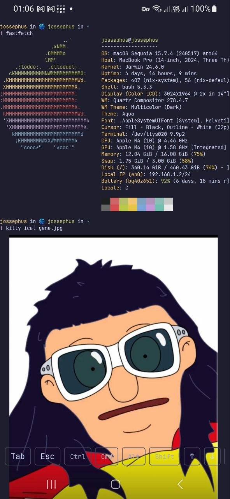
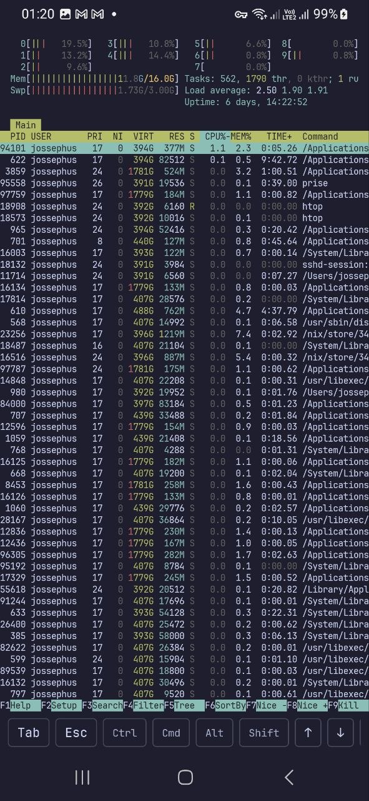
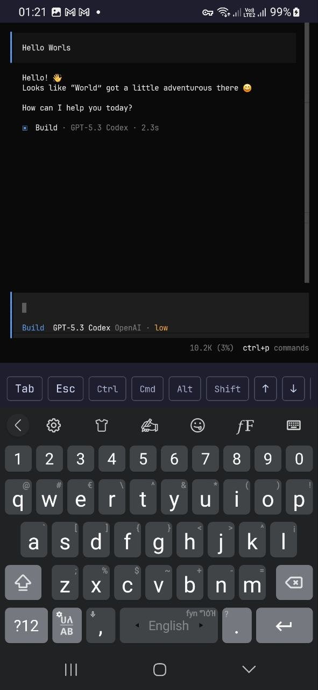
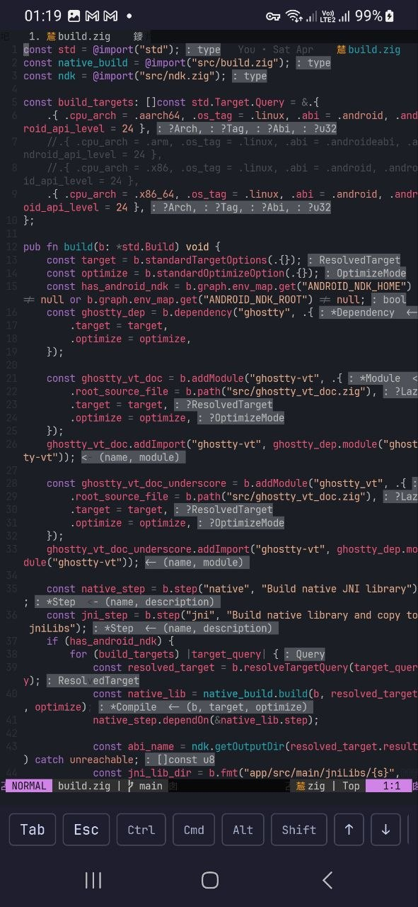

<p align="center">
  
</p>

# Chuchu

Chuchu is a native Android SSH client powered by libghostty, a terminal-first Compose UI, and support for both standard SSH and Tailscale SSH workflows.

<table align="center" cellpadding="10">
  <tr>
    <td></td>
    <td></td>
  </tr>
</table>

## Status

Chuchu is in active development. I am daily driving it and improving any issues i found in the way. Join the journey and report any bugs you find. And I welcome any contributions.

## Stack

- Kotlin + Jetpack Compose for the Android app
- Zig for native build orchestration and JNI/native bridge code
- Ghostty VT for terminal emulation
- `libssh2` + `mbedtls` for the current native SSH path
- Room for local data storage

## Project Layout

```text
.
|- app/          Android application code, Compose UI, Room, ViewModels
|- src/          Top-level Zig entrypoints and docs shims
|- assets/       Any assets we use for the project.
```

### Try It Out

Checkout our releases and download the apk from there. The latest release will have the latest changes.

I don't have a personal Play Store account right now (and I can't open one because of the payment limitation in my country, feel free to contact me if you want to publish it.)

### Development - Prerequisites

If you have nix installed make build will build the zig native code, and 'make app' will install 

1. nix develop - will set you up with everything you will need.
2. running 'make build' will build the native code needed 
3. running 'make app' will build the apk and install it in a connected device. 

If you don't have nix installed, you will need

1. setup tools
- Android Studio - This will set up the needed Android SDK, Android NDK and Java runtime (JDK 17+).
- Zig 0.15.2
2. build the native library

Set `ANDROID_NDK_HOME` or `ANDROID_NDK_ROOT`, then build the JNI library for Android arm64:

```sh
zig build jni -Dtarget=aarch64-linux-android
```

That copies `libchuchu_jni.so` into `app/src/main/jniLibs/arm64-v8a/`.

3. From android studio run 
```sh
./gradlew assembleDebug
```

## What Works Today

- Server list and add/edit server flows
- Password-based SSH sessions
- Tailscale SSH flow using server-side auth policy (`none` auth)
- Host key verification and changed-key warnings
- Terminal resize, scrollback, focus, modifier keys, and paste
- Native terminal color/title/bell updates

## Inspiration

I have been using [vvterm](https://github.com/vivy-company/vvterm) on iOS for the past few weeks and i really liked it.  This project came from my desire to have native ssh client but for android.

## Project Name
chuchu is one of my favorite characters from the amharic book [Yesinbit Kelemat](https://www.goodreads.com/book/show/30759971) [it means colors of adios]. 

## More Screenshots

<table align="center" cellpadding="10">
  <tr>
    <td></td>
    <td></td>
  </tr>
</table>


